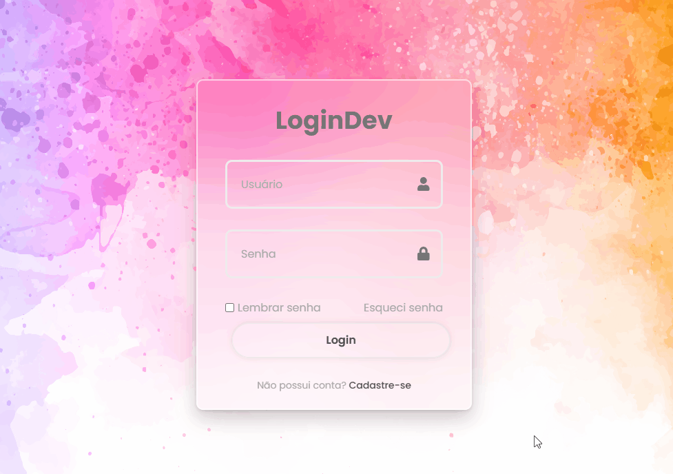

 # Projeto Tela de Login 

### Projeto de uma interface de login moderna, desenvolvida com HTML e CSS, usando ícones do Font Awesome e efeitos visuais como blur e sombra para um design elegante e atrativo.

[](https://alicetolosa.github.io/projeto-tela-login01/?#)

             Clique no Gif da imagem e acesso o meu meu projeto 👆


## Tecnologia utilizadas 🚀
- Html 
- Css
- Font Awesome (CDN)


## Principais Tags no Html 🚀


````
✔ <div> : para agrupar elementos.

✔ <input> : para criar campos de entrada de dados (texto, senha, checkbox).

✔ <i> : para aplicar ícones (com bibliotecas como Font Awesome).

✔ <label> : para criar rótulos para campos de formulário.

✔ <a> : para criar links (para outras páginas, arquivos, seções).

✔ <button> : para criar botões clicáveis.

✔ <p> : para criar parágrafos de texto.
````


## Principais Tags no Html 🚀

```bash
git clone https://github.com/alicetolosa/projeto-tela-login01.git 
```


## O que aprendi com este Projeto 🚀
A desenvolver uma  interface de login responsiva utilizando apenas HTML e CSS, que me permitiu consolidar os conceitos importantes do desenvolvimento front-end.

#### Durante o processo, aprendi a:

📦 Utilizar a estrutura HTML semântica para criar formulários claros e organizados;

🎨 Aplicar estilização com CSS, explorando propriedades como flexbox, border-radius, box-shadow, e backdrop-filter;

✍️ Criar campos de entrada (input) personalizados com ícones e placeholders;

🧠 Usar o Font Awesome para adicionar ícones funcionais e estéticos aos inputs;

🔁 Trabalhar com efeitos de hover para botões e links, melhorando a experiência do usuário;

🧊 Reproduzir o efeito "glassmorphism", um estilo visual moderno com fundo embaçado e bordas translúcidas;

🌐 Tornar o layout responsivo e centralizado com Flexbox, adaptável a diferentes tamanhos de tela;

🧩 Organizar e reaproveitar estilos com classes bem definidas no CSS;

🧠 E principalmente, entender como a estrutura visual e funcional de um formulário pode ser feita com recursos simples, porém eficazes.